# ✈️ TravelBuddy – AI-Powered Trip Planner & Expense Manager

  <b>Plan trips • Split expenses • Collaborate • Pay seamlessly • AI-powered insights</b>

  

---

## 📌 About the Project

TravelBuddy is a **full-stack web application** that helps users **plan trips, manage expenses, and collaborate with friends in real time**.

It combines **AI-powered trip planning**, **expense tracking**, and **secure payment integration** into one seamless platform.

---

## ✨ Features

- 🔐 Authentication (Clerk – Google + Email)
- 🧳 Trip Creation & Management
- 👥 Add & Manage Trip Members
- 💸 Smart Expense Splitting
- 💳 Razorpay Payment Integration
- 🤖 AI Trip Planner
- 💬 Group Chat System
- 📊 Real-time Expense Summary
- 🌐 Fully Responsive UI

---

## 🛠 Tech Stack

### 🚀 Frontend
- Next.js (App Router)
- Tailwind CSS
- Shadcn UI

### ⚙️ Backend
- Next.js API Routes
- Supabase (Database)

### 🔐 Authentication
- Clerk

### 💳 Payments
- Razorpay

### 🤖 AI Integration
- OpenAI / OpenRouter

---

## 📸 Screenshots

### 🏠 Landing Page

  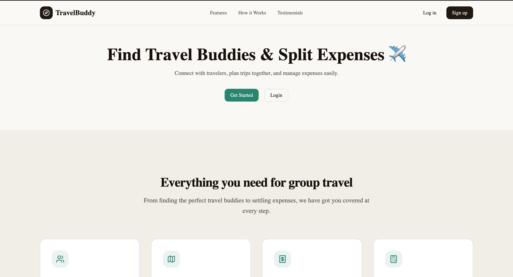
  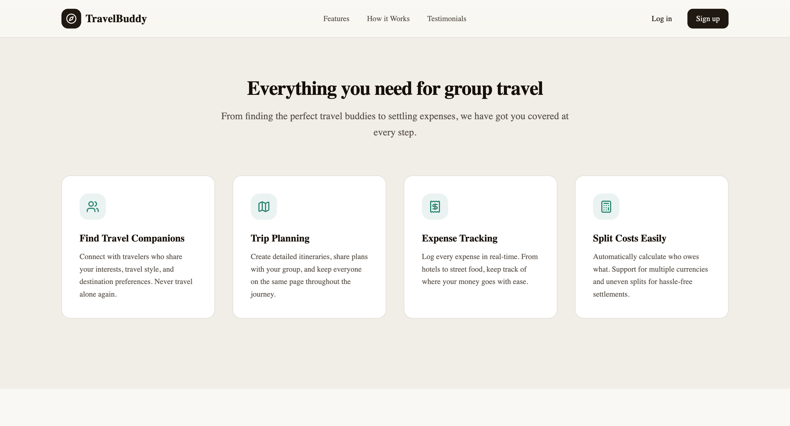

  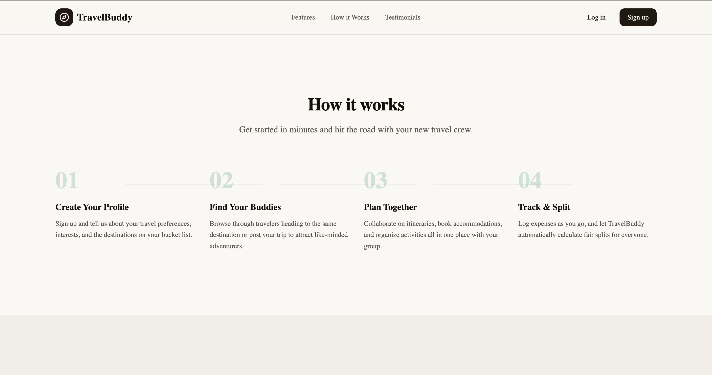
  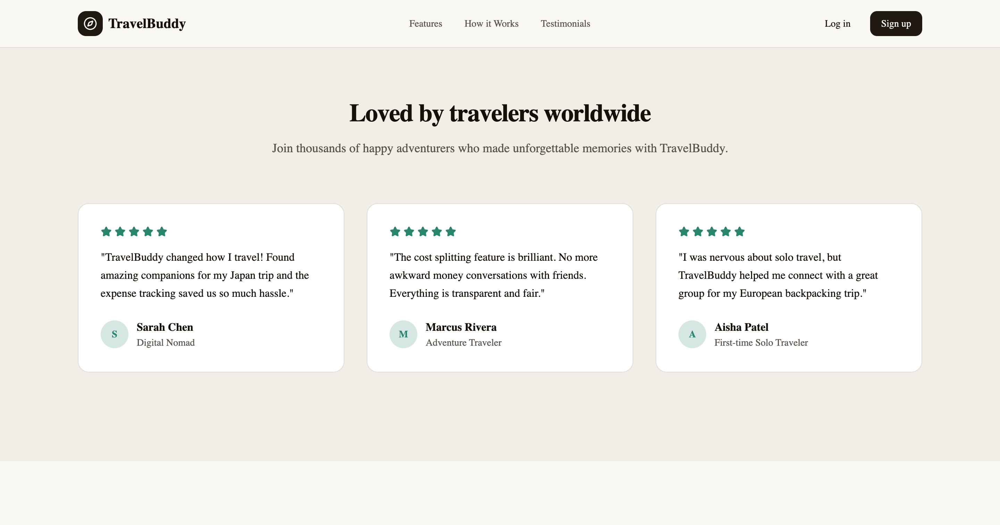

  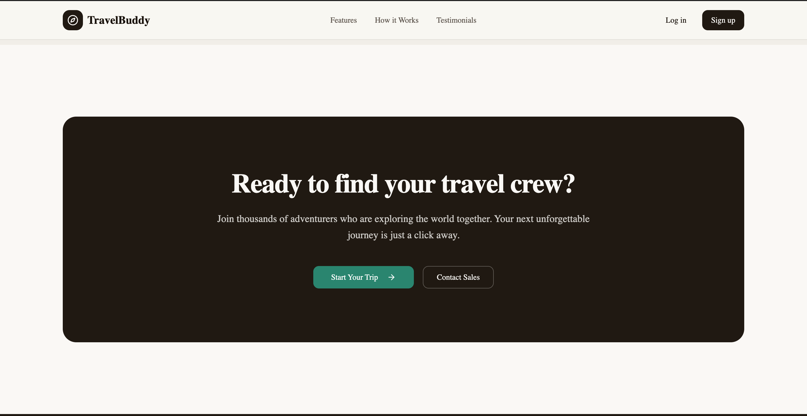
  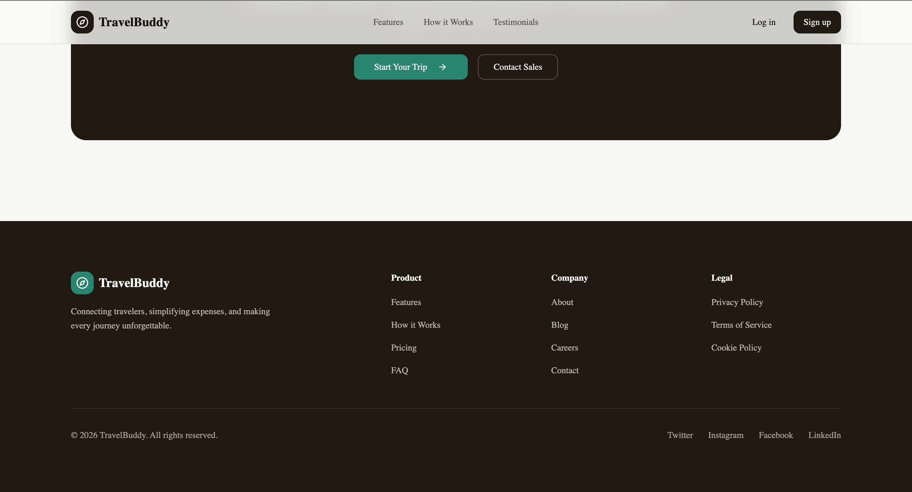

---

### 🧳 Create Trip

  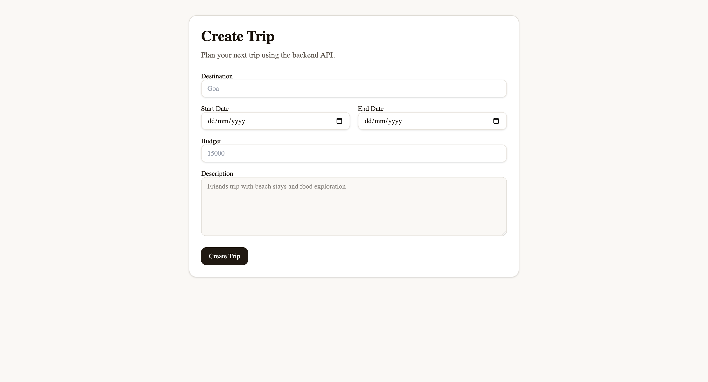

---

### 📊 My Trips Dashboard

  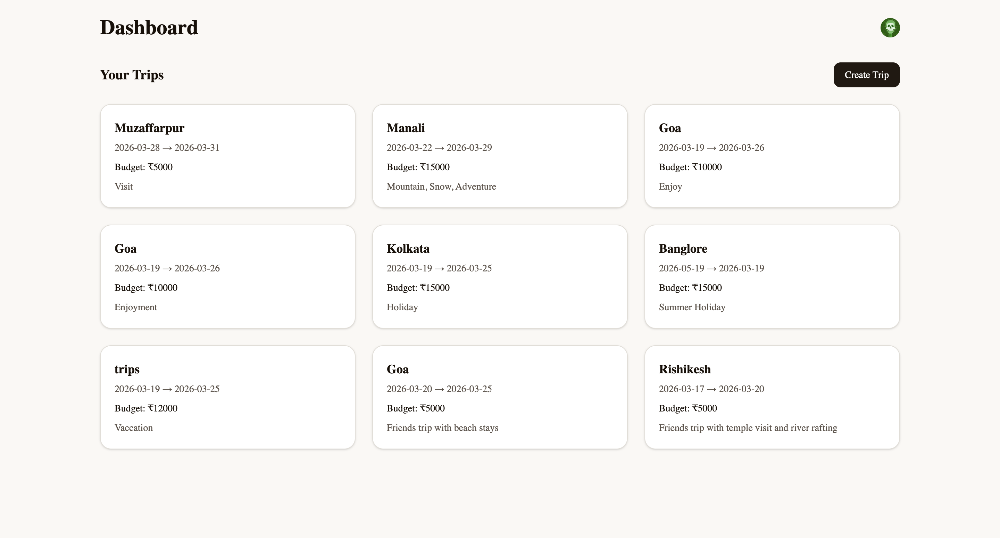

---

### 🔍 Explore Trips

  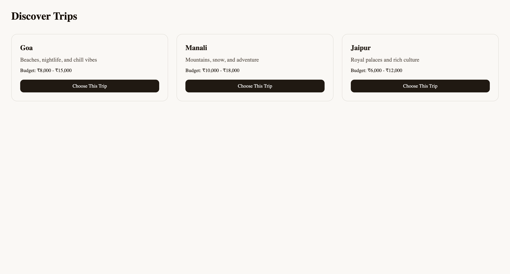

---

### 🤝 Collaborations

  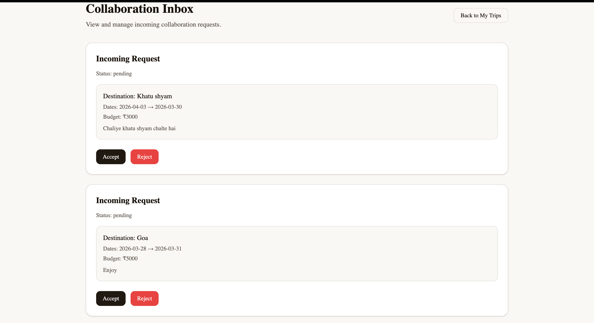

---

### ✅ Active Collaborations

  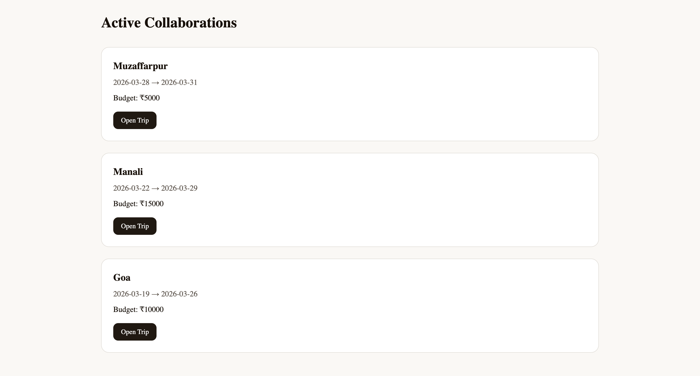

---
